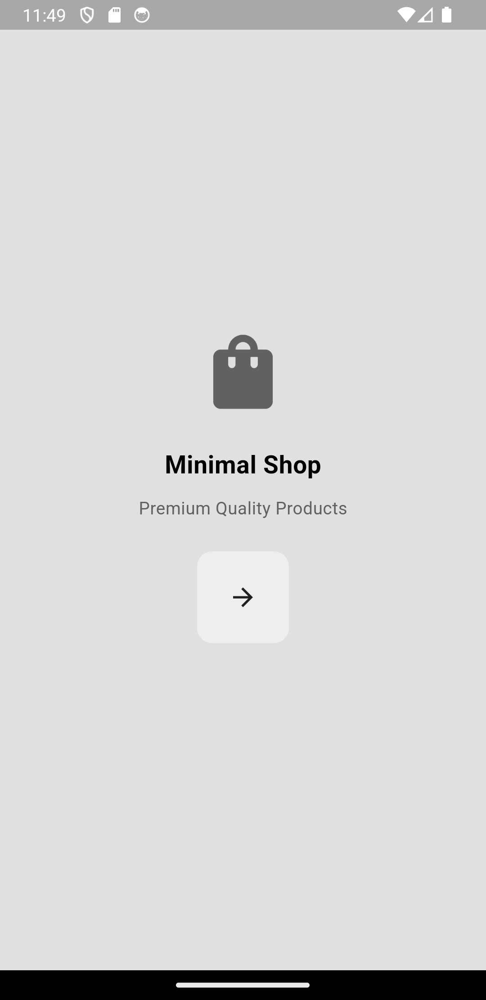
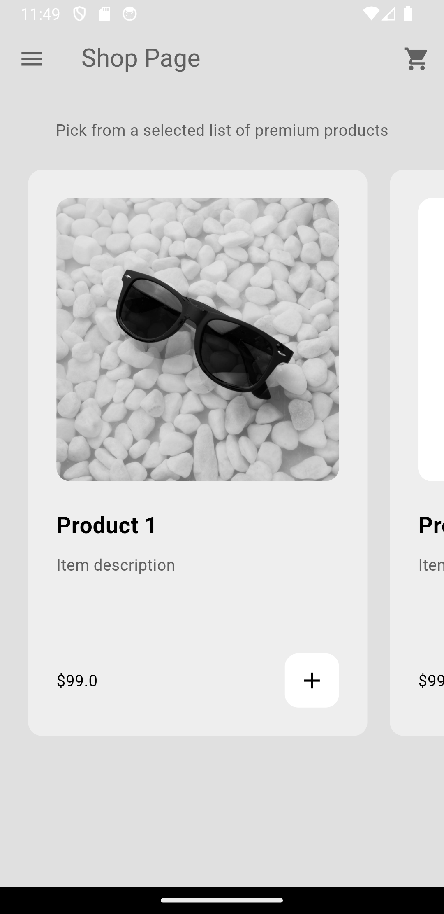
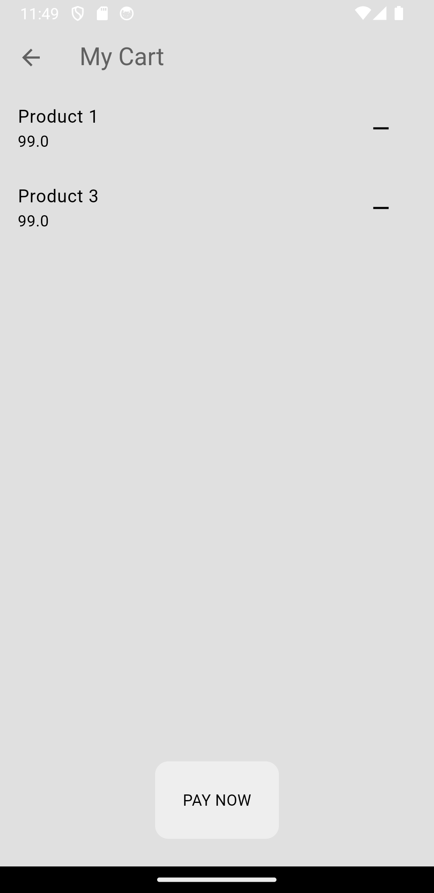
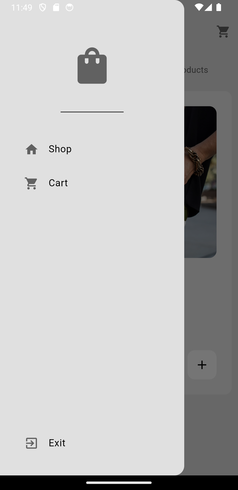

# Minimal Ecommerce App

## Version 1.0

A basic e-commerce application, complete with cart functionality. Users can browse the latest collections and add/remove items to their cart.

## Features

- Browse a wide selection of products.
- View detailed product descriptions, including images and prices.
- Add items to the shopping cart.
- Remove items from the cart.

## Screenshots

|  |  |  |
| :---:|:---:|:---:|
| Landing Screen | Home Screen | Cart Screen |

|  |
| :---:|
| Drawer |

## Installation

### Prerequisites

- Flutter SDK (^3.5.2 )

### Clone the Repository

```sh
git clone https://github.com/agrpaavan/flutter-minimal-ecommerce-app.git
cd flutter-minimal-ecommerce-app
```

### Install Dependencies

```sh
flutter pub get
```

### Configuration

**Create `key.properties` File**:

- You will need this when you build your app to sign the APK.
- Inside the `android/` folder, create a file named `key.properties`.
- Add your keystore configuration details to `key.properties`. Replace the placeholders with your actual keystore information:

```properties
storePassword=YOUR_KEYSTORE_PASSWORD
keyPassword=YOUR_KEY_PASSWORD
keyAlias=upload
storeFile=YOUR_KEYSTORE_LOCATION
```

### Run the App

```sh
flutter run
```

## APK Download and Installation

You can download the latest APK file from the [Releases](https://github.com/agrpaavan/flutter-minimal-ecommerce-app/releases) section of this repository.

### Installation Instructions

1. **Download the APK**:
   - Go to the [Releases page](https://github.com/agrpaavan/flutter-minimal-ecommerce-app/releases) and download the latest APK file.

2. **Install the APK**:
   - Follow the prompts to install the app on your Android device.

## Contributing

Feel free to fork this repository and make improvements or suggest features!

1. Fork the repository.
2. Create a new branch for your changes.
3. Commit your changes and push to your branch.
4. Open a pull request to merge your changes.

## Issues

If you encounter any issues or have suggestions, please use the [Issue Tracker](https://github.com/agrpaavan/flutter-minimal-ecommerce-app/issues) to report them.

## License

This project is licensed under the MIT License - see the [LICENSE](https://github.com/agrpaavan/flutter-minimal-ecommerce-app/blob/main/LICENSE) file for details.

## Acknowledgments

- [Flutter](https://flutter.dev/) - The framework used for building this app.
- [Material Design](https://material.io/design) - Design system used for UI components.
- **Tutorial**: This project was created following the tutorial by Mitch Koko. You can watch the tutorial [here](https://www.youtube.com/watch?v=rYdP2LnBGsA).
